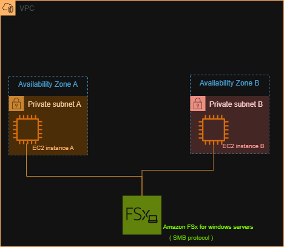

# Amazon FSx for Windows File Server

## Project Overview

This project demonstrates a simple AWS architecture using **Amazon FSx for Windows File Server** to provide shared file storage for EC2 instances.

The architecture contains two EC2 instances located in separate Availability Zones within a VPC. Both instances access the Amazon FSx file system using the **SMB (Server Message Block)** protocol.

## Architecture

### Components

* **Amazon VPC** — Provides the isolated network environment.
* **Availability Zone A** — Contains EC2 Instance A in a private subnet.
* **Availability Zone B** — Contains EC2 Instance B in a private subnet.
* **EC2 Instance A** — Application/server instance that accesses the shared file system.
* **EC2 Instance B** — Another instance that can access the same shared file system.
* **Amazon FSx for Windows File Server** — Provides managed shared Windows file storage.
* **SMB** — Protocol used by Windows clients to access the file system.

## How It Works

1. Two EC2 instances are placed in separate Availability Zones.
2. Both instances are located in private subnets within the VPC.
3. Amazon FSx for Windows File Server provides shared file storage.
4. The EC2 instances access the shared file system using SMB.
5. Because the storage is shared, both instances can access the same files.

## Why Use Amazon FSx?

Amazon FSx for Windows File Server is useful for workloads that require:

* Shared Windows file storage
* SMB support
* Windows-based applications
* Managed file-system infrastructure
* Integration with Windows environments

## FSx vs EFS

| Feature     | Amazon FSx for Windows File Server      | Amazon EFS                            |
| ----------- | --------------------------------------- | ------------------------------------- |
| Primary use | Windows workloads                       | Linux workloads                       |
| Protocol    | SMB                                     | NFS                                   |
| File system | Windows-based                           | Linux-compatible                      |
| Common use  | Windows applications and shared folders | Linux applications and shared storage |

## What I Learned

Through this project, I learned:

* What Amazon FSx is
* What FSx for Windows File Server is used for
* How FSx differs from EFS
* How EC2 instances can use shared file storage
* The role of SMB in Windows file sharing
* How shared storage can be represented in an AWS architecture

## Project Status

> **Note:** This project was completed as a learning and architecture exercise. No production infrastructure was deployed.

> No AWS console lab was completed for this exercise because a suitable free hands-on FSx lab was not available without requiring an AWS payment card.
