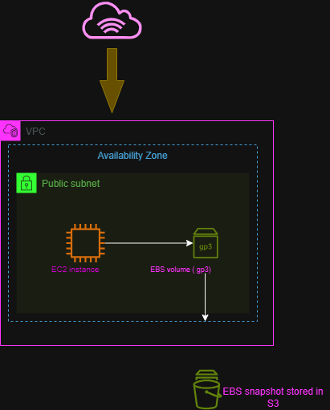

# Amazon EBS – Elastic Block Store

## Overview

This project demonstrates the fundamentals of **Amazon Elastic Block Store (EBS)** and how EBS provides persistent block storage for Amazon EC2 instances.

The project focuses on creating an EBS volume, understanding how it attaches to an EC2 instance, and understanding how EBS snapshots are used for backup and recovery.

> **Note:** This project was completed as a learning and architecture exercise. No production infrastructure was deployed.
> No AWS console lab was completed for this exercise because a suitable free hands-on EBS lab was not available without requiring an AWS payment card.


---

## What I Built

The architecture demonstrates:

* An Amazon VPC
* A public subnet inside an Availability Zone
* An EC2 instance
* An EBS gp3 volume attached to the EC2 instance
* An EBS snapshot created from the volume

### Architecture Flow

```text
EC2 Instance
      │
      ▼
EBS Volume (gp3)
      │
      ▼
EBS Snapshot
```

The EBS volume provides persistent block storage for the EC2 instance, while the snapshot represents a point-in-time backup of the volume.

---

## Architecture Diagram



The editable draw.io version is also included in this project:

`Diagrams/EBS-Diagram.drawio`

---

## Key Concepts Learned

### Amazon EBS

Amazon Elastic Block Store provides persistent block-level storage that can be attached to EC2 instances.

Unlike temporary instance storage, EBS volumes persist independently from the lifecycle of the EC2 instance.

### EBS gp3

The project uses a **gp3 General Purpose SSD** volume.

gp3 allows storage, IOPS, and throughput to be configured independently, making it a flexible option for many general-purpose workloads.

### Availability Zones

EBS volumes are associated with a specific Availability Zone.

An EBS volume normally needs to be in the same Availability Zone as the EC2 instance it is attached to.

### EBS Snapshots

An EBS snapshot is a point-in-time backup of an EBS volume.

Snapshots can be used to:

* Back up data
* Restore volumes
* Create new EBS volumes
* Support disaster-recovery strategies

---

## What I Learned

Through this project, I learned:

1. What Amazon EBS is and why it is used with EC2.
2. How an EBS volume provides persistent block storage.
3. The purpose of gp3 volumes.
4. The relationship between EBS volumes and Availability Zones.
5. How EBS snapshots are used for backup and recovery.
6. The difference between persistent EBS storage and temporary instance storage.
7. How to represent an EC2 and EBS architecture using a cloud diagram.

---

## Skills Demonstrated

* Amazon EC2 fundamentals
* Amazon EBS
* EBS gp3
* EBS snapshots
* AWS Availability Zones
* AWS architecture diagrams
* Cloud storage concepts
* Documentation with Markdown
* Git and GitHub project organization

---

## Project Structure

```text
EBS/
├── Diagrams/
│   ├── EBS-Diagram.drawio
│   └── EBS-Diagram.png
└── README.md
```

The `.drawio` file is the editable source diagram, while the `.png` file allows the architecture to be viewed directly on GitHub.

---

## Conclusion

This project helped me understand how **Amazon EBS provides persistent block storage for EC2 instances** and how snapshots can be used to protect and recover stored data.

It also strengthened my understanding of how AWS storage services fit into a basic cloud architecture.
