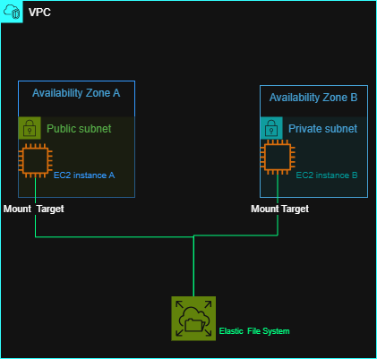

# Amazon EFS Project

## Overview

This project demonstrates the basic architecture of **Amazon Elastic File System (EFS)** and how it can provide shared file storage for multiple EC2 instances.

The architecture uses two EC2 instances in different Availability Zones. Each instance connects to Amazon EFS through an EFS mount target.

## Architecture



### Components

* **VPC** — Provides the network environment for the resources.
* **Availability Zone A** — Contains EC2 Instance A and an EFS mount target.
* **Availability Zone B** — Contains EC2 Instance B and an EFS mount target.
* **Private Subnets** — Host the EC2 instances and EFS mount targets.
* **EC2 Instance A** — Connects to the EFS file system.
* **EC2 Instance B** — Connects to the same EFS file system.
* **EFS Mount Targets** — Provide network access to EFS from each Availability Zone.
* **Amazon EFS** — Provides shared, scalable file storage that can be accessed by multiple EC2 instances.

## What Was Built

The architecture demonstrates:

1. Two EC2 instances deployed across two Availability Zones.
2. An EFS mount target in each Availability Zone.
3. Both EC2 instances connecting to the same Amazon EFS file system.
4. Shared file storage that can be accessed from multiple instances.

## What I Learned

* What Amazon EFS is and when it is used.
* How EFS provides shared file storage.
* The purpose of EFS mount targets.
* How EFS can be accessed from EC2 instances in different Availability Zones.
* The difference between instance-specific storage and shared file storage.

## Project Files

```text
Elastic-File-System/
├── Diagrams/
│   ├── Elastic-File-System-Diagram.drawio
│   └── Elastic-File-System-Diagram.png
└── README.md
```
> No AWS console lab was completed for this exercise because a suitable free hands-on Amazon EFS lab was not available without requiring an AWS payment card.

